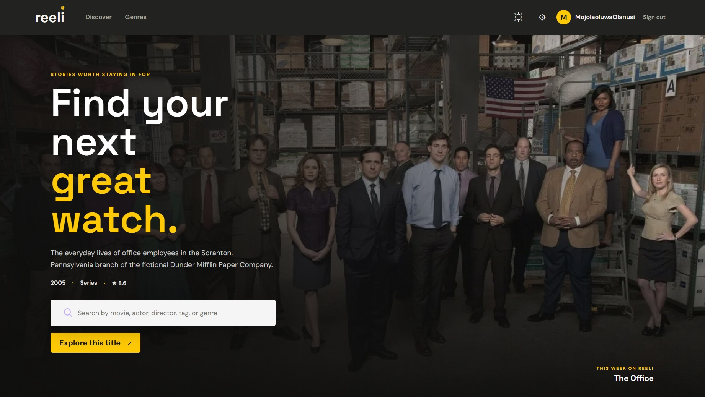

<div align="center">
	
	<h1>reeli</h1>
	<p><strong>Find your next great watch.</strong></p>
	<p>Explore movies, anime, and series by title, cast, crew, and genre.</p>
	<p>
		<a href="https://reeli-movies.vercel.app">Open Reeli</a> ·
		<a href="#features">Features</a> ·
		<a href="#getting-started">Get started</a>
	</p>
</div>

<p align="center">
	
</p>

## About

Reeli is a movie discovery app built around one question: *what should I watch next?* Browse regional picks, explore horizontal genre shelves, then open a dedicated title page for the story, cast, age rating, release timeline, trailer, and regional watch options.

## Features

- Live movie, series, and people search powered by TMDB.
- Regional picks ranked from the signed-in user's movie-detail and watch-provider interactions.
- Scrollable shelves for Animation, Anime, Horror, Fantasy, Action, Science Fiction, Comedy, and more.
- Shareable title routes: `/movies/movie/:id` and `/movies/tv/:id`.
- Google sign-in with Appwrite; title details are available after signing in.
- Title pages with cast and roles, crew, age rating, release/air dates, series status, trailers, recommendations, and watch providers.
- Best-effort AniList enrichment for anime descriptions and manga/manhwa information.
- Light and dark themes with browser-local preferences and recent searches.

> **Recommendations:** Picks use only the signed-in user's own activity and regional TMDB popularity. Interaction documents are permissioned to their owner; Reeli does not expose other users' private viewing history.

## Built With

| Area | Technology |
| --- | --- |
| Frontend | React, Vite, React Router |
| API | Node.js, Express |
| Movie data | TMDB API |
| Anime enrichment | AniList GraphQL |
| Authentication | Appwrite, Google OAuth |
| Hosting | Vercel-compatible API and route handlers |

## Getting Started

### Requirements

- Node.js 20 or later
- A TMDB API Read Access Token or API v3 key
- An Appwrite project if Google sign-in is required

### Install and run

```bash
npm install
npm run dev
```

The local Express + Vite app runs at `http://localhost:5173`. It proxies TMDB requests through the server so the TMDB credential is not bundled into the browser.

### Environment variables

Create `.env.local` in the project root:

```dotenv
# Required for live movie data. Set one server-only credential.
TMDB_API_READ_ACCESS_TOKEN=your_tmdb_read_access_token
# Alternative to the read access token:
# TMDB_API_KEY=your_tmdb_v3_api_key

# Optional; required only for Google sign-in.
VITE_APPWRITE_ENDPOINT=https://your-region.cloud.appwrite.io/v1
VITE_APPWRITE_PROJECT_ID=your_appwrite_project_id

# Required for interaction-based Top Picks.
VITE_APPWRITE_DATABASE_ID=your_appwrite_database_id
VITE_APPWRITE_INTERACTIONS_TABLE_ID=user_interactions
```

Do not commit `.env.local`, prefix TMDB credentials with `VITE_`, or put the Google OAuth client secret in the frontend environment.

### Configure Google sign-in

1. In Appwrite Console, enable Google under **Auth → Settings → OAuth2 providers**.
2. Create a Google OAuth client. Add the callback URL shown by Appwrite to Google's **Authorized redirect URIs**.
3. Enter the Google client ID and secret in Appwrite's Google provider settings.
4. Under **Auth → Settings → Platforms**, add `localhost` and the exact production hostname `reeli-movies.vercel.app` as Web platforms. Use the hostname only, without `https://` or a path. This exact host allowlist is especially important for Safari on iPhone.
5. Copy the Appwrite project ID and API endpoint into `.env.local`.

If Google returns to Reeli but the iPhone still shows signed out, open the site directly in Safari (not an embedded browser), confirm the exact production hostname is listed as an Appwrite Web platform, and check that the endpoint matches the same Appwrite project. The app now retries session restoration after the OAuth return and when Safari returns to the page. If Safari still cannot retain the Appwrite session, configure an Appwrite custom domain on a domain you own so the auth endpoint and app use the same site; do not disable Safari privacy protections globally.

### Create the interaction table

In Appwrite Console, create a database and a table with ID `user_interactions`. Enable **Row Security**. Allow authenticated users to **Create** and **Read** rows at the table level so the client can save and query activity. Do not grant table-level Update or Delete. Each row is created with read, update, and delete permissions restricted to its owner, and the app filters queries by the signed-in user's Appwrite ID; row security keeps other users' activity hidden.

Add these table columns:

| Column | Type | Required | Notes |
| --- | --- | --- | --- |
| `ownerId` | String, 36 | Yes | Appwrite user ID |
| `movieKey` | String, 64 | Yes | `movie:TMDB_ID` or `tv:TMDB_ID` |
| `mediaType` | String, 8 | Yes | `movie` or `tv` |
| `tmdbId` | String, 20 | Yes | TMDB identifier |
| `title` | String, 255 | Yes | Display title |
| `genres` | String array, item size 64 | Yes | Genres used to personalize picks |
| `detailViews` | Integer | Yes | Default `0`, minimum `0` |
| `watchClicks` | Integer | Yes | Default `0`, minimum `0` |
| `lastInteractedAt` | Datetime | Yes | Updated on each recorded interaction |

Create key indexes for `(ownerId ASC, movieKey ASC)` and `(ownerId ASC, lastInteractedAt DESC)`. Copy the database ID and table ID into `.env.local` using `VITE_APPWRITE_DATABASE_ID` and `VITE_APPWRITE_INTERACTIONS_TABLE_ID`, then restart locally. Add the same values to Vercel's environment settings and redeploy.

The app records a detail-page open and a watch-provider click. Provider clicks are weighted more heavily, and recent activity has more influence. Before interactions exist, Top Picks falls back to regional TMDB popularity. No Appwrite API key is needed or should be exposed in the browser. Recent search strings and display preferences remain browser-local.

## Commands

| Command | Description |
| --- | --- |
| `npm run dev` | Start the local Express + Vite app |
| `npm run lint` | Run ESLint |
| `npm run build` | Build the production frontend |
| `npm start` | Start the standalone Node production server |

## Deployment

Vercel uses the repository's API handlers and route rewrites. Add `TMDB_API_READ_ACCESS_TOKEN` (recommended) or `TMDB_API_KEY` as a server-side environment variable. For Google sign-in, also add `VITE_APPWRITE_PROJECT_ID` and `VITE_APPWRITE_ENDPOINT`. Redeploy after changing environment variables.

For another Node host, run `npm run build` then `npm start`; configure `PORT` and the same environment variables in the host's secret settings.

## Attribution

This product uses the TMDB API but is not endorsed or certified by TMDB. Anime data may be supplemented by AniList.

## License

No license has been added yet. All rights reserved unless the repository owner chooses and adds a license.